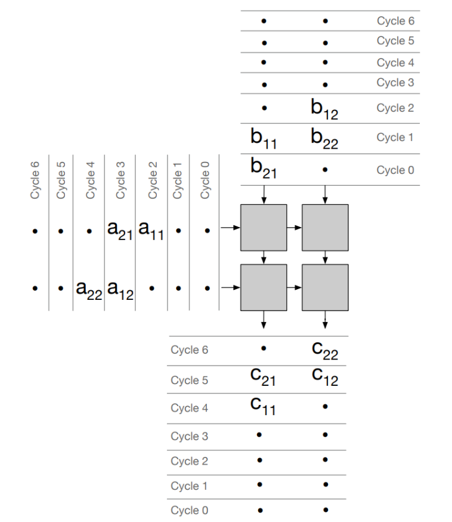
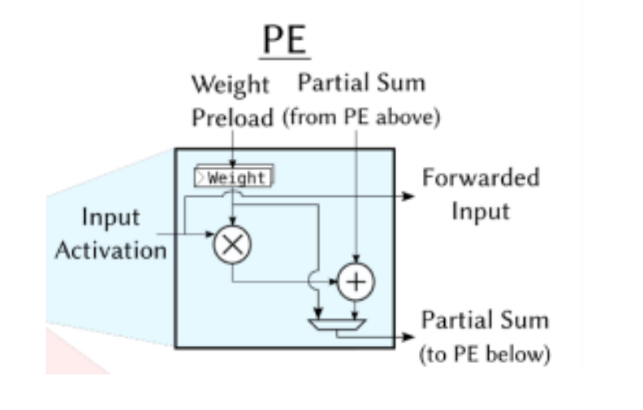
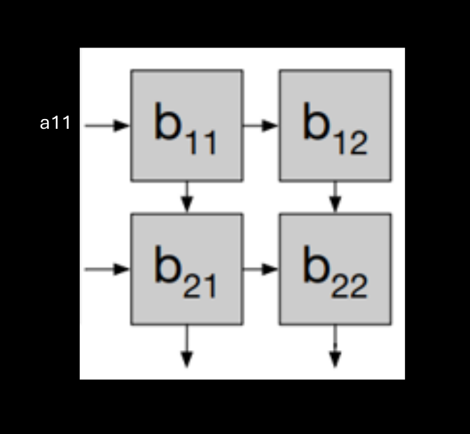
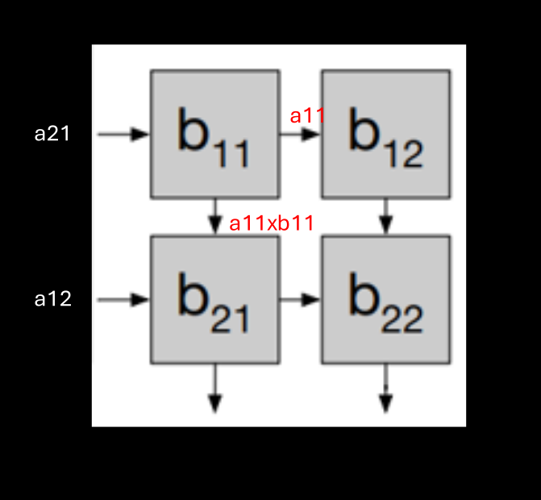
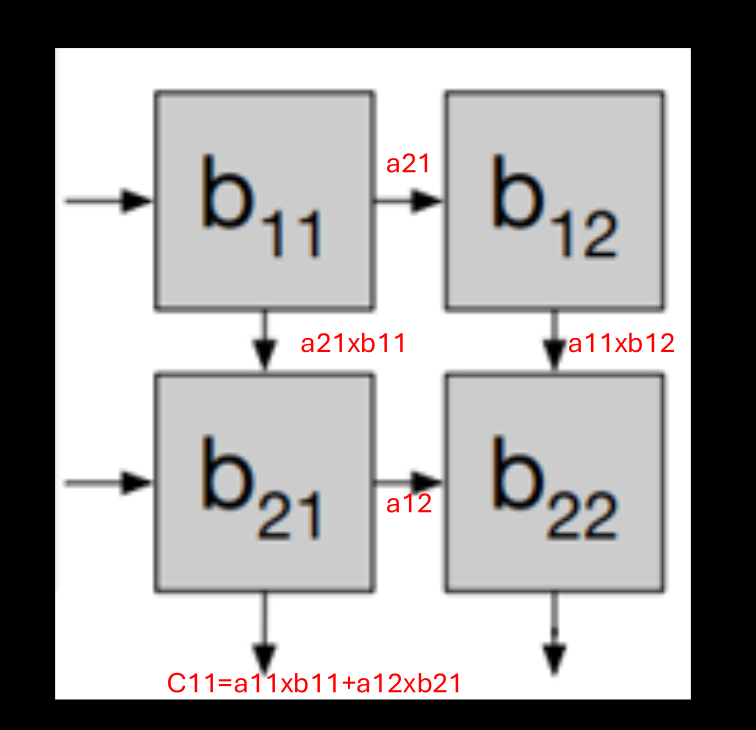
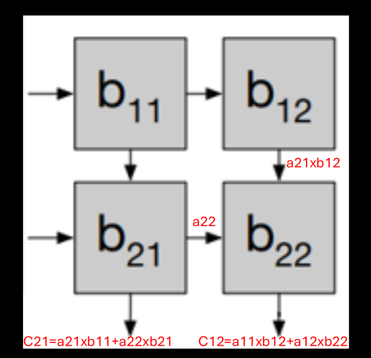
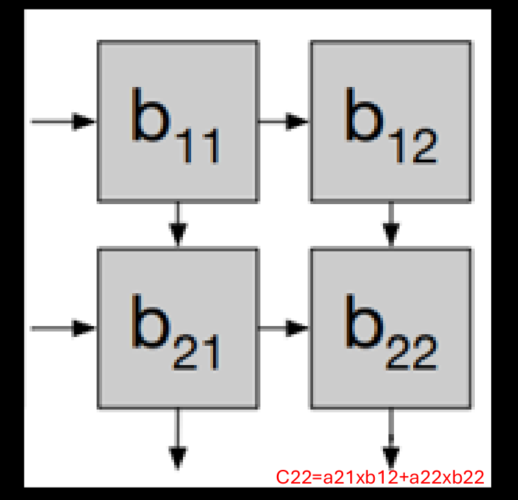
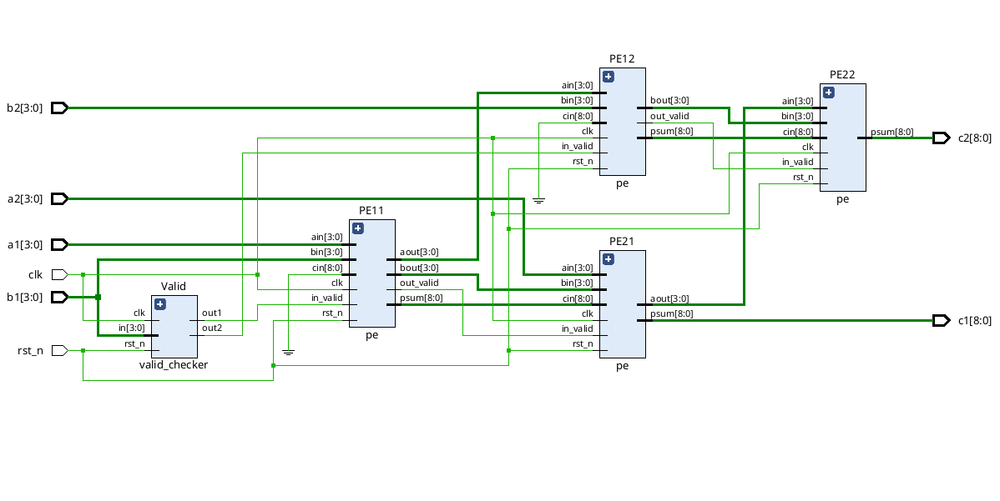
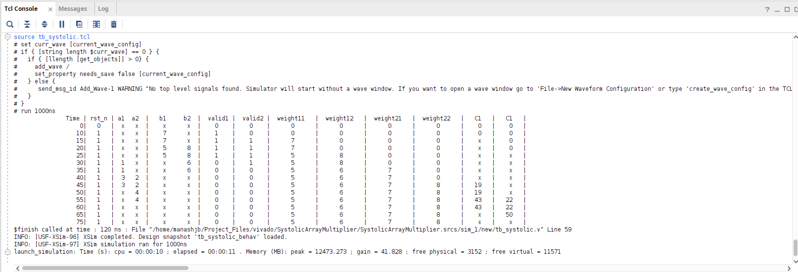
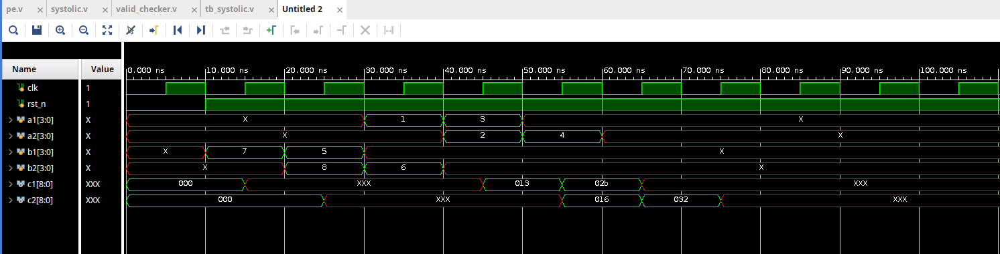

# 2x2 Systolic Array Matrix Multiplier (Verilog RTL)

## Project Summary
Designed and implemented a 2×2 Systolic Array-based Matrix Multiplier in Verilog RTL, utilizing a weight-stationary dataflow architecture where weights remain locally stored within processing elements. The Weights are loaded once and then reused for multiple cycles.

## Systolic Array
- 2×2 grid of Processing Elements (PEs)
- **Row-wise streaming** of matrix A
- **Column-wise propagation** of matrix B
- Partial sums accumulated across pipeline stages

systolic2x2 (systolic2x2.v) 
├── PE11 (pe.v) 
├── PE12 (pe.v) 
├── PE21 (pe.v) 
├── PE22 (pe.v) 
└── valid_checker (valid_checker.v)

## Processing Element (PE) 
The Processing Element (PE) is the fundamental building block of the systolic array architecture. Each PE performs a **Multiply-Accumulate (MAC)** operation and enables efficient data propagation across the array.

### Functional Description
Each PE takes three inputs:
- `ain` → Input activation (from left)
- `bin` → Weight (from top)
- `cin` → Partial sum (from upper PE)

It produces:
- `aout` → Forwarded activation (to the right)
- `bout` → Forwarded weight (to the bottom)
- `psum` → Updated partial sum

The core computation performed is:
psum = (ain × weight) + cin

Some additional control signaling I used for proper dataflow across the systolic array:
- `clk` → System clock signal
- `rst_n` → Active-low reset signal
- `in_valid` → Input valid signal for weight.
- `out_valid` → Output valid signal for weight.
  
The signals `in_valid` and `out_valid` is used to control dataflow and enable weight-stationary behavior. When `in_valid` is high, weights are loaded into the Processing Elements (PEs) and stored in internal registers. When `in_valid` is low, the stored weights are retained, making them **stationary** and reusable across multiple cycles. The `out_valid` signal from each PE is propagated to the next stage as `in_valid`.

## Valid Checker
The `valid_checker` module is responsible for generating a reliable valid signal in the systolic array design. It ensures that the output data is considered valid only when all required inputs have been properly propagated through the pipeline.

The dataflow during various cycles are shown below:
1. **CYCLE 0**

2. **CYCLE 1**

3. **CYCLE 2**

4. **CYCLE 3**

5. **CYCLE 4**

## RESULTS

| Time | rst_n | a1 | a2 | b1 | b2 | valid1 | valid2 | weight11 | weight12 | weight21 | weight22 | C1  | C2  |
|------|-------|----|----|----|----|--------|--------|----------|----------|----------|----------|-----|-----|
| 0    | 0     | x  | x  | x  | x  | 0      | 0      | 0        | 0        | 0        | 0        | 0   | 0   |
| 10   | 1     | x  | x  | 7  | x  | 1      | 0      | 0        | 0        | 0        | 0        | 0   | 0   |
| 15   | 1     | x  | x  | 7  | x  | 1      | 1      | 7        | 0        | 0        | 0        | x   | 0   |
| 20   | 1     | x  | x  | 5  | 8  | 1      | 1      | 7        | 0        | 0        | 0        | x   | 0   |
| 25   | 1     | x  | x  | 5  | 8  | 1      | 1      | 5        | 8        | 0        | 0        | x   | x   |
| 30   | 1     | 1  | x  | x  | 6  | 0      | 1      | 5        | 8        | 0        | 0        | x   | x   |
| 35   | 1     | 1  | x  | x  | 6  | 0      | 0      | 5        | 6        | 7        | 0        | x   | x   |
| 40   | 1     | 3  | 2  | x  | x  | 0      | 0      | 5        | 6        | 7        | 0        | x   | x   |
| 45   | 1     | 3  | 2  | x  | x  | 0      | 0      | 5        | 6        | 7        | 8        | 19  | x   |
| 50   | 1     | x  | 4  | x  | x  | 0      | 0      | 5        | 6        | 7        | 8        | 19  | x   |
| 55   | 1     | x  | 4  | x  | x  | 0      | 0      | 5        | 6        | 7        | 8        | 43  | 22  |
| 60   | 1     | x  | x  | x  | x  | 0      | 0      | 5        | 6        | 7        | 8        | 43  | 22  |
| 65   | 1     | x  | x  | x  | x  | 0      | 0      | 5        | 6        | 7        | 8        | x   | 50  |
| 75   | 1     | x  | x  | x  | x  | 0      | 0      | 5        | 6        | 7        | 8        | x   | x   |

